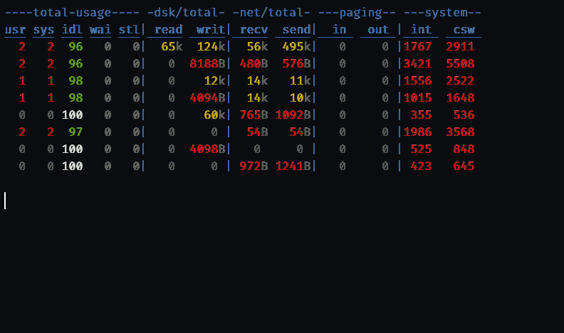

# rbstat

A Go clone of the classic Linux [`dstat`](http://dag.wieers.com/home-made/dstat/)
resource-utilization CLI. It samples `/proc` at a fixed interval, diffs the
counters, and prints colorized, dash-padded, fixed-width columns that line up
with — and are colored like — real `dstat`.



```
----total-usage---- -dsk/total- -net/total- ---paging-- ---system--
usr sys idl wai stl| read  writ| recv  send|  in   out | int   csw
  2   2  97   0   0|  64k  122k|  56k  496k|  64k  122k|1766  2910
  1   1  98   0   0|   0     0 | 132B  674B|   0     0 |1331  2129
```

Single static binary, **Linux only**, no external dependencies (stdlib only).

## Install

Prebuilt artifacts are attached to each [GitHub release](https://github.com/binRick/rbstat/releases).

**RPM (RHEL/CentOS/Rocky/Alma 9 & 10):**

```sh
# el10, x86_64 (use the el9 / aarch64 asset to match your system)
sudo rpm -Uvh https://github.com/binRick/rbstat/releases/latest/download/rbstat-0.1.0-1.el10.x86_64.rpm
```

**Static binary (no dependencies):** download the asset matching your arch
(`amd64`, `arm64`, `386`, `arm`, `ppc64le`, `s390x`, `riscv64`), e.g.

```sh
curl -L -o rbstat https://github.com/binRick/rbstat/releases/latest/download/rbstat-0.1.0-linux-amd64
chmod +x rbstat && ./rbstat
```

`SHA256SUMS` is attached for verification.

## Build

```sh
go build -o rbstat .
```

Requires Go 1.22+. The program reads `/proc`, so it runs on Linux; it
cross-compiles from any host with `GOOS=linux`. Release artifacts are built
with `scripts/build-rpms.sh` (el9/el10 RPMs via containers) and static
`CGO_ENABLED=0` cross-compiles for the arches above.

## Usage

```
rbstat [-cdngymslrt] [options] [delay [count]]
```

`delay` is the seconds between updates (default `1`) and `count` the number of
updates (default `0` = forever). With no stat flags it uses `-cdngy`, just like
dstat.

### Stat flags

| Flag | Long | Group | Columns |
|------|------|-------|---------|
| `-c` | `--cpu`  | total usage  | usr sys idl wai stl |
| `-d` | `--disk` | dsk/total    | read writ (bytes/s) |
| `-n` | `--net`  | net/total    | recv send (bytes/s) |
| `-g` | `--page` | paging       | in out |
| `-y` | `--sys`  | system       | int csw |
| `-m` | `--mem`  | memory usage | used free buf cach |
| `-s` | `--swap` | swap         | used free |
| `-l` | `--load` | load avg     | 1m 5m 15m |
| `-t` | `--time` | time         | current time |
| `-r` | `--io`   | io/total     | read writ (IOPS) |
| `-a` | `--all`  | — | shorthand for `-cdngy` |

Short flags cluster, so `rbstat -cdn 1 5` selects cpu, disk and net, updating
every second five times.

### Options

| Flag | Effect |
|------|--------|
| `--nocolor`   | disable ANSI colors (also auto-disabled when stdout is not a terminal) |
| `--noheaders` | print the header once, never repeat it |
| `--noupdate`  | accepted for compatibility (rbstat is always scrolling) |
| `--list`      | list available stats |
| `--version`   | print the version |
| `-h`, `--help`| show help |

## Fidelity to dstat

rbstat is matched column-for-column against the `dstat` (pcp-dstat 7.1.5)
shipped on CentOS Stream 10: the dash-padded group bars, the `|` separators,
the `dchg`/`fchg` number formatting (base-1024 bytes with `B/k/M/G…` suffixes),
and the magnitude-based ANSI color buckets are reproduced exactly. `used`
memory uses the procps/`free` formula (`MemTotal − MemFree − Buffers − Cached −
SReclaimable + Shmem`) and matches dstat to the kilobyte.

A few intentional differences from the installed pcp-dstat:

- **First line** shows the average since boot (classic dstat / `vmstat`
  behavior) instead of a blank row.
- **Default set** is `-cdngy` with no leading time column.
- **Scrolling only** — no in-place line redraw.

## Architecture

```
main.go        wire CLI -> engine
cli.go         argument parser (clustered short flags, [delay [count]])
engine.go      sample loop, since-boot priming, tty detection, signals
internal/
  collect/     Collector interface, RateBase counter-diffing, /proc parsing
  collectors/  one file per stat group (cpu, disk, net, page, sys, ...)
  format/      str.center dash padding + dchg/fchg number fitting
  color/       ANSI theme and the value-coloring rule
  render/      two-row header, data rows, separators, header cadence
```

Each stat group implements `collect.Collector`. Rate groups embed
`collect.RateBase`, which centralizes counter diffing over the measured
wall-clock interval; gauge groups (memory, swap, load) return instantaneous
values. See [`SPEC.md`](SPEC.md) for the full design.

## Code statistics

<!-- scc-start -->
## Code Statistics

| Language | Files | Lines | Blanks | Comments | Code | Complexity |
|---|---|---|---|---|---|---|
| Go | 29 | 1,838 | 210 | 180 | 1,448 | 288 |
| Markdown | 3 | 674 | 151 | 0 | 523 | 0 |
| Shell | 2 | 74 | 9 | 19 | 46 | 10 |
| **Total** | **34** | **2,586** | **370** | **199** | **2,017** | **298** |

- **Estimated Cost to Develop (organic):** $56,433
- **Estimated Schedule Effort (organic):** 4.61 months
- **Estimated People Required (organic):** 1.09
- **Processed:** 91,056 bytes (0.091 megabytes)

*Generated with [scc](https://github.com/boyter/scc) on 2026-06-18*
<!-- scc-end -->

## License

MIT
